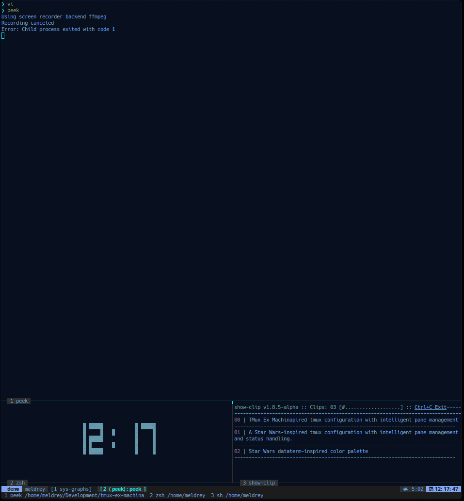

# TMux Ex Machina

A Star Wars-inspired tmux configuration with intelligent pane management and status handling.



## Features

- 🎨 Star Wars-inspired color scheme with deep space background and dataterm accents
- 🖥️ Dynamic pane title management
- 📊 Intelligent status bar with system metrics
- 🔄 Vim integration for context-aware pane titles
- 🚀 ZSH plugins for enhanced status management
- ⌨️ Vim-style keybindings for navigation
- 🖱️ Mouse mode support for easy navigation

## Components

### Theme
- Star Wars dataterm-inspired color palette
- Powerline-style status indicators
- System resource monitoring
- Session and window management

### Pane Title Manager
- Automatic updates based on current activity
- Integration with Vim/Neovim
- Git branch information display
- Command context awareness

### Status Plugin
- Custom status message support
- Integration with Powerlevel10k
- Persistent status across commands
- Automatic cleanup on exit

## Installation

### Quick Install
```bash
git clone https://github.com/yourusername/tmux-ex-machina.git
cd tmux-ex-machina
./install.sh
```

### Manual Installation

1. Clone the repository:
```bash
git clone https://github.com/yourusername/tmux-ex-machina.git
cd tmux-ex-machina
```

2. Install the theme:
```bash
mkdir -p ~/.tmux/themes
cp themes/exmachina.tmux.conf ~/.tmux/themes/
cp config/.tmux.conf ~/.tmux.conf
```

3. Install the ZSH plugins:
```bash
mkdir -p ${ZSH_CUSTOM:-~/.oh-my-zsh/custom}/plugins/tmux-ex-machina
cp -r plugins/* ${ZSH_CUSTOM:-~/.oh-my-zsh/custom}/plugins/tmux-ex-machina/
```

4. Add the plugin to your `.zshrc`:
```bash
plugins=(... tmux-ex-machina)
```

5. Install the Vim plugin:
```bash
# For Vim
mkdir -p ~/.vim/plugin
cp plugins/pane-title/vim-pane-title.vim ~/.vim/plugin/

# For Neovim
mkdir -p ~/.config/nvim/plugin
cp plugins/pane-title/vim-pane-title.vim ~/.config/nvim/plugin/
```

## Configuration

### Theme Customization
The Ex Machina theme can be customized by modifying the color variables in `~/.tmux/themes/exmachina.tmux.conf`:

```bash
# Deep Space Background: #0A1428
# Bright Interface Blue: #7CB7FF
# Dataterm Cyan: #00F1FF
# Mid-space Blue: #1C2F45
# Light Interface Blue: #5CC2F2
```

### Status Plugin
The status plugin can be used to set custom status messages:

```bash
# Set a status message
status "Debugging authentication service"

# Clear the status
clear_status
```

### Vim Integration
Customize the Vim pane title format in your `.vimrc`:

```vim
let g:vim_pane_title_format = 'vim: %f%m [%Y]%r'
```

## Requirements

- tmux >= 3.0
- Zsh
- Oh My Zsh (recommended)
- Vim >= 8.0 or Neovim >= 0.5.0
- (Optional) Powerlevel10k for enhanced status integration
- (Optional) vim-fugitive for git integration

## Contributing

Contributions are welcome! Please feel free to submit a Pull Request.

## License

MIT

## Credits

Color scheme inspired by Star Wars dataterminal aesthetics and modern terminal themes.
